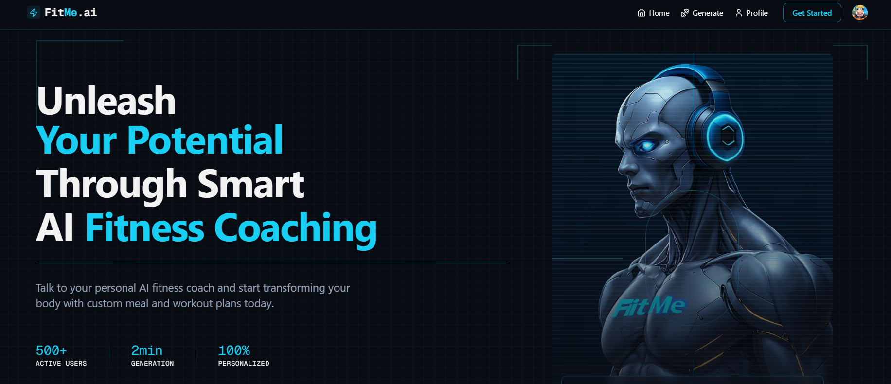
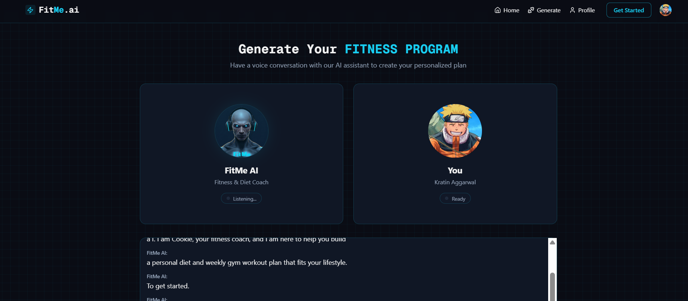
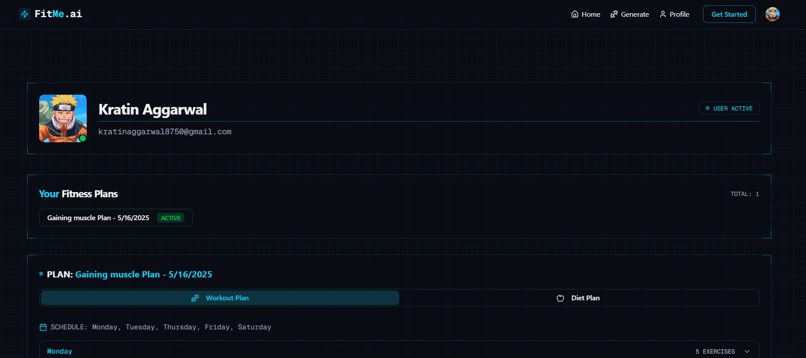

# FitMe-AI Fitness Assistant 🤖💪

<div align="center">

[](https://nextjs.org/)
[](https://tailwindcss.com/)
[](https://ui.shadcn.com/)
[](https://clerk.dev/)
[](https://vercel.com/)
[](https://ai.google.dev/)
[](https://vapi.ai/)
[]()


</div>

<p align="center">Fitme-ai is your personalized AI fitness companion. It generates tailored workout and diet plans based on your needs using advanced voice and language AI. Built with Next.js, Tailwind, Shadcn UI, and powered by Clerk, Vapi, Gemini AI & Convex DB.</p>

<div align="center">

[Features](#-features) •
[Technologies](#%EF%B8%8F-technologies-used) •
[Installation](#-installation--setup) •
[Structure](#-project-structure) •
[Deployment](#-deployment) •
[Contact](#-contact)


</div>

---

## 📸 Screenshot

<div align="center">
  <!-- Full-width image on top -->
  
  
  <!-- Two images side by side -->
  
  
</div>


---

## ✨ Features

<table>
 <tr>
  <td>✅ <b>AI Fitness Assistant</b></td>
  <td>An intuitive conversational interface that gently guides users by understanding their health goals, preferences, and any physical limitations.</td>
</tr>
<tr>
  <td>✅ <b>Personalized Plans</b></td>
  <td>Workout routines and diet suggestions thoughtfully generated using Gemini AI, tailored to each individual's unique needs.</td>
</tr>
<tr>
  <td>✅ <b>Voice Support</b></td>
  <td>Voice-enabled interactions through Vapi to make the experience more engaging and hands-free.</td>
</tr>
<tr>
  <td>✅ <b>User Auth & Dashboard</b></td>
  <td>Secure sign-in with GitHub, Google, or email using Clerk, along with a simple dashboard to manage and view fitness programs.</td>
</tr>
<tr>
  <td>✅ <b>Real-time Updates</b></td>
  <td>Plans are generated and updated in real-time, powered by Convex DB, ensuring responsiveness and reliability.</td>
</tr>
<tr>
  <td>✅ <b>Responsive UI</b></td>
  <td>Clean and adaptive design using Tailwind CSS and Shadcn UI, offering a smooth experience across all devices.</td>
</tr>

</table>

---

## 🛠️ Technologies Used

<div align="center">

| 🧠 Core | 🎨 UI | 🔒 Auth | 🗄️ Backend | 🎙️ AI |
|--------|--------|--------|------------|-------|
| Next.js | Tailwind CSS | Clerk | Convex DB | Vapi |
| React | Shadcn UI | | | Gemini AI |

</div>

---

## 🚀 Installation & Setup

<details>
<summary><b>Environment Setup</b></summary>
<br>

1. Clone the repository:
   ```bash
   git clone https://github.com/your-username/fitme-ai.git
   cd fitme-ai
2. Install dependencies:
   ```bash
   npm install
   ```
3. Setup your .env file:
   ```bash
    cp .env.example .env
    ``` 
4. Add your environment variables:
   - **Clerk**: Sign up at [Clerk](https://clerk.dev/) and get your API keys.
   - **Convex DB**: Sign up at [Convex](https://convex.dev/) and get your API keys.
   - **Vapi**: Sign up at [Vapi](https://vapi.ai/) and get your API keys.
   - **Gemini AI**: Sign up at [Gemini AI](https://gemini.ai/) and get your API keys.
    

5. Start the development server:
   ```bash
   npm run dev
   ```
6. Open your browser and navigate to `http://localhost:3000`.
</details>


---
## 📂 Project Structure

```bash
├──fitme-ai/
├── .next/                      # Next.js build output
├── convex/                    # Convex database logic
├── node_modules/              # Installed dependencies
├── public/
│   ├── assets/
│   │   ├── images/
│   │   └── icons/
│   └── favicon.ico
├── src/
│   ├── app/                   # App routes and pages
│   │   ├── (auth)/            # Auth-related pages (sign-in, sign-up)
│   │   ├── components/        # UI and shared components
│   │   ├── constants/         # Constants for the app
│   │   ├── generate-program/  # AI workout/diet generation module
│   │   ├── profile/           # User profile-related pages
│   │   ├── favicon.ico
│   │   ├── globals.css        # Global styles
│   │   ├── layout.tsx         # Root layout component
│   │   └── page.tsx           # Main homepage
│   ├── lib/                   # Utility and helper functions
│   └── providers/             # Context providers (e.g., theme, auth)
├── .env.local                 # Local environment variables
├── .gitignore
├── components.json
├── eslint.config.js
├── next-env.d.ts
├── next.config.js
├── package.json
├── package-lock.json
├── postcss.config.mjs
└── README.md
```

---
## 📦 Deployment
<div align="center">

[](https://vercel.com/new?utm_source=github&utm_medium=fitme-ai&utm_campaign=oss)
</div>
<p align="center">Deploy your own instance of Fitme-ai on Vercel with a single click!</p>


---
## 🤝 Contributing

We welcome contributions to Fitme-ai! If you'd like to contribute, please follow these steps:

1. Fork the repository.
2. Create a new branch for your feature or bug fix.
3. Make your changes and commit them with clear messages.
4. Push your changes to your forked repository.
5. Submit a pull request detailing your changes.

Thank you for your interest in contributing to Fitme-ai!

## 📜 License

This project is licensed under the MIT License - see the [LICENSE](LICENSE) file for details.

## 🙏 Acknowledgement
- [Next.js](https://nextjs.org/) for the powerful framework.
- [Tailwind CSS](https://tailwindcss.com/) for the beautiful UI.
- [Shadcn UI](https://ui.shadcn.com/) for the UI components.
- [Clerk](https://clerk.dev/) for user authentication.
- [Convex DB](https://convex.dev/) for the backend database.
- [Vapi](https://vapi.ai/) for voice interactions.
- [Gemini AI](https://gemini.ai/) for AI-powered fitness plans.


## 📧 Contact
For any inquiries or feedback, please reach out to us at [kratinaggarwal8750@gmail.com](mailto:kratinaggarwal8750@gmail.com)
